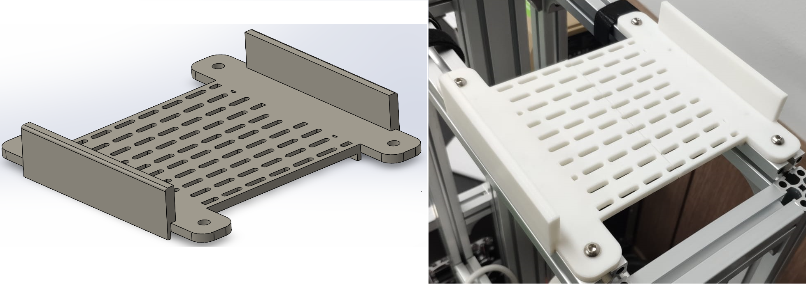
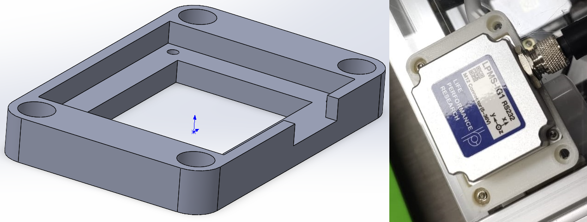
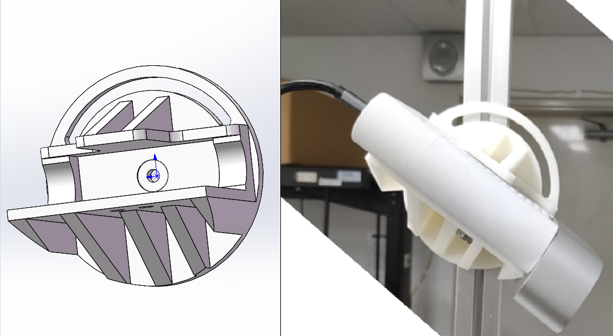
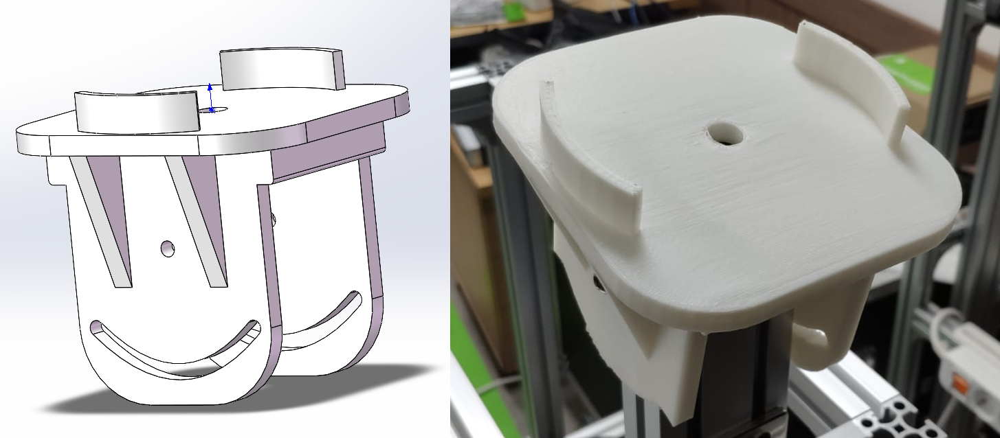
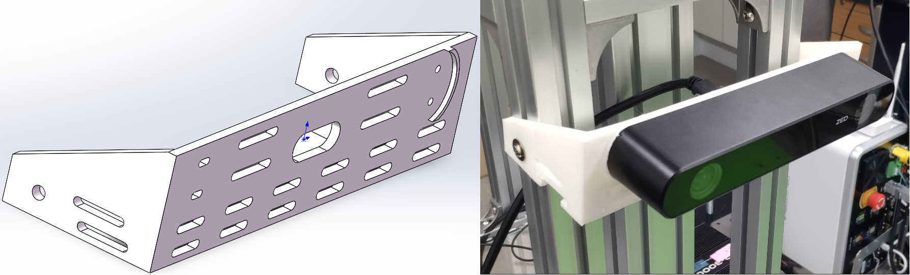

# 3D-Models

## [TDR-3000 GPS](https://github.com/sibl-lab/3D-Models/tree/main/GPS%20Platform)

## [IMU LPMS-IG1](https://github.com/sibl-lab/3D-Models/tree/main/IMU)

## [Microsoft Azure Kinect Depth Camera](https://github.com/sibl-lab/3D-Models/tree/main/Azure%20Kinect%20DK)

## [Velodyne 16-Ch](https://github.com/sibl-lab/3D-Models/tree/main/Velodyne%2016-Ch)

## [Zed 2i](https://github.com/sibl-lab/3D-Models/tree/main/Zed%202i)
